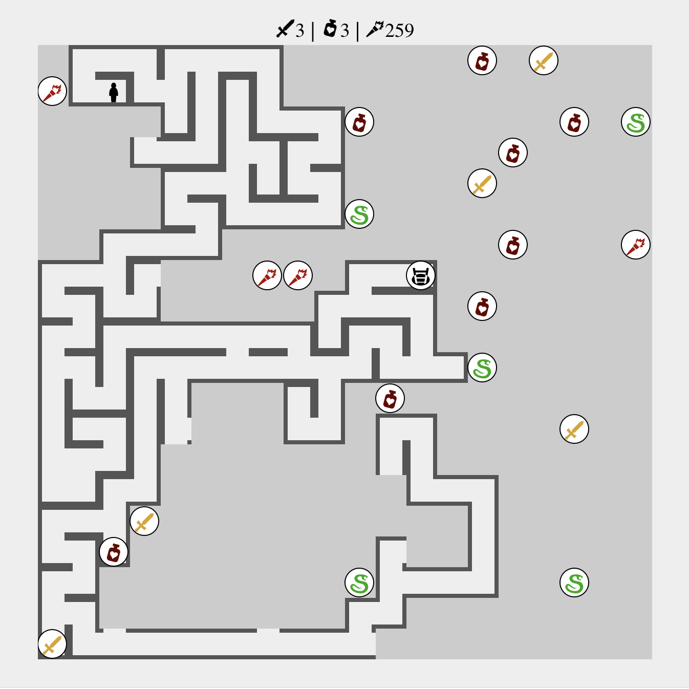

# Yangeon Game

Simple game implemented with Elixir, Phoenix 1.5 & LiveView.

## Game board overview

## Rules

* You are a hero in a labyrinth.
* To win you should find the exit and come to it having the key.
* The key is kept by one of the snakes.
* You spend a sword or 5 HP to kill a snake (and loot the key).
* If you have 0 HP you die.
* Torches help to see farther.

